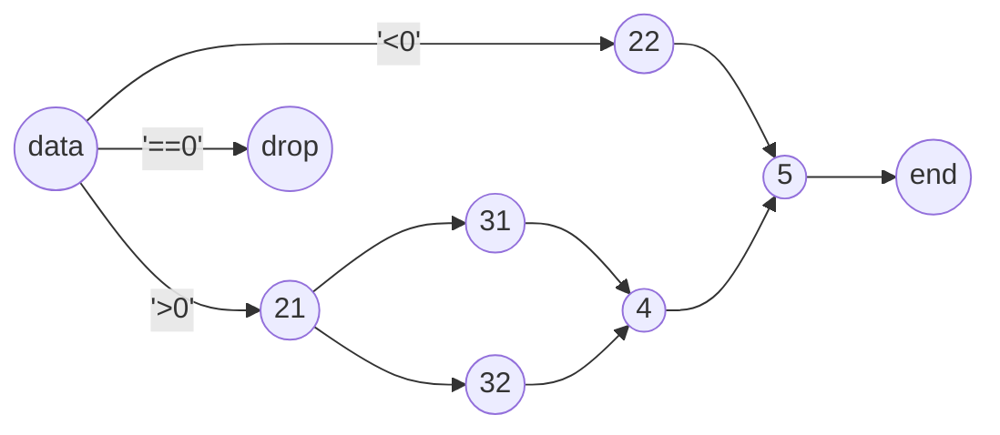

# async_pipeline
complex async data pipelines with functional methods

## Features
`async_pipeline` aims to simplify the creation of asynchronous pipelines.

Main features are:

* Simplicity. 
  Allows defining not only linear pipelines, 
  but also complex pipelines with cross structures.
* Fast. 
  Each pipeline process is implemented through a coroutine process, 
  which could avoid blocking by async functions.
* Easy-to-read. 
  Linear previous and after stages can be connected using pipeline operator, 
  making it more readable.
* Easy-to-use. 
  Provides functional like methods.

## Quick Start
### install
```shell
python setup.py install
```

### Simple linear pipeline
In this example, the data is multiplied by 2, and then filtered out those greater than 5. 
The functions in each stage can be synchronous or asynchronous.
```python
import asyncio
from async_pipeline.pipe import Pipe

async def double(x):
    await asyncio.sleep(0.01)
    return x * 2
    
pipe = Pipe()  # create a pipe
stage1 = pipe.data(range(5))  # define data stage
stage2 = pipe.map(func=double, src=stage1)  # define map stage, async func
stage3 = pipe.filter(func=lambda x: x > 5, src=stage2)  # define filter stage, sync func
stage4 = pipe.result(src=stage3)  # define result stage, store result in stage4.result
pipe.run()  # run pipe
print(stage4.result)  # [6, 8]
```

Use pipe operator to abbreviate:
```python
pipe = Pipe()
stage = range(5) | pipe.map(func=double) | pipe.filter(func=lambda x: x > 5) | pipe.result()
pipe.run()
```

### Complex non-liner pipeline
This pipeline can be described in the following diagram:

```python
from async_pipeline.pipe import Pipe

pipe = Pipe()
stage1 = [-1, 0, 1] | pipe.partition({
    'p': {
        'match': "elem > 0",
        'handle': pipe.map(func=lambda x: str(x) + '_21') 
                  | pipe.multiply(
                      pipe.map(func=lambda x, y: str(x) + y, func_kw={'y': '_31'}),
                      pipe.map(func=lambda x: str(x) + '_32')
                  )
    },
    'n': {
        'match': "elem < 0",
        'handle': pipe.map(func=lambda x: str(x) + '_22')
    }
})
stage2 = pipe.concat(
                pipe.concat(stage1['p'][0], stage1['p'][1]) | pipe.map(func=lambda x: str(x) + '_4'),
                stage1['n']
          ) \
          | pipe.map(func=lambda x: str(x) + '_5') \
          | pipe.result()
pipe.run()
print(sorted(stage2.result))  # ['-1_22_5', '1_21_31_4_5', '1_21_32_4_5']
```

## Supported Python Versions
* 3.7
* 3.8
* 3.9
* 3.10

## Unittest
```shell
pip install -r requirements/test.txt
python -m unittest
```

## API Reference


### class `Pipe`
All methods are called through pipe instance. 

#### `pipe = Pipe()`

Create a *pipe*. 

Different pipes do not affect each other.

#### `pipe.run()`

Execute stages in *pipe*, let the data start flowing. 

Before this, all Stage functions are just record as coroutines. 
Each pipe can be executed only once.

#### `await pipe.async_run()`

The asynchronous version of `run`.

#### `pipe.cancel()`

Cancel the coroutines in the pipeline that have not yet executed.

### class `Stage`
Each section of the pipeline, i.e. each process, is called a *stage*.

stages are always associated with a pipeline, 
so the stage instance is created through the *pipe* interface

#### `pipe.data(src)`

Create a *Data Stage*. Place it at the beginning.

`src` is data source, needs to be iterable or async iterable. 

This method is optional because the data source can be placed directly, 
except that the code check will say "Class 'xx' does not define '\__or__'"

```python
stage = pipe.data(range(10))
```

#### `pipe.result(src=None, output=None)`

Create a *Result Stage*. Place it at the end.

`src` is previous stage.
When using the pipeline operator, the left side of `|` is the previous Stage, so src is not specified at this time.

`output` locate the pipeline output, can be a list or any object that accepts `append` method. Default is self.result.

```python
# 1
previous = pipe.data(range(10))
end = pipe.result(src=previous)
# 2
end = previous | pipe.result()
# 3
result = []
end = previous | pipe.result(output=result)
```

#### `pipe.map(func, src=None, func_kw=None)`

Create a *Map Stage*, it executes `result = func(elem, **func_kw)` for each element passed in, and outputs the *result*.

`func` is function object, either sync or async. 

`func_kw` is parameters of `func` other than element, like *kwargs* dict.

`src` is previous stage, *None* when using `|`.

```python
# 1
stage = pipe.map(func=lambda x: x + 1, src=previous)
# 2
stage = previous | pipe.map(func=some_func)
# 3
stage = previous | pipe.map(func=lambda x, y: x + y, func_kw={'y': 1})
```

#### `pipe.filter(func, src=None, func_kw=None)`

Create a *Filter Stage*, it computes flag = func(elem, **func_kw) for each element passed in, and outputs the *element* with flag True.

`func` is function object, either a sync or async. 

`func_kw` is parameters of `func` other than element, like *kwargs* dictionary.

`src` is previous stage, *None* when using `|`.

```python
# 1
stage = pipe.filter(func=lambda x: x > 0, src=previous)
# 2
stage = previous | pipe.filter(func=some_bool_func)
# 3
stage = previous | pipe.filter(func=lambda x, y: x > y, func_kw={'y': 0})
```

#### `pipe.flatten(src=None)`

Create a *Flatten Stage*, it flattens each element passed in and output.

`src` is previous stage which outputs a two-level list, or iterable or async iterative two-level list. *None* when using `|`.

```python
# 1
stage = pipe.flatten(src=[[1], [2, 3]])
# 2
stage = previous | pipe.flatten()
```

#### `pipe.concat(*src)`

Create a *Concat Stage*, it merges the list of stages. 

`*src` is multi previous stages, or iterable or async iterative lists.

```python
# 1
stage = pipe.concat([1, 2], [3, 4])
# 2
stage = pipe.concat(
    data | pipe.map(func=lambda x: x), 
    data | pipe.filter(func=lambda x: x > 0), 
)
```

#### `pipe.partition(cases, src=None)`

Create a *Partition Stage*, it outputs elements to branch by condition.

`cases` can be a key-value dictionary. The key is the allies, and the value is the matching logic with single param *elem*. 

Elements are calculated by dict order, and output to the first match. Those do not match any branch will drop.

Next stage's `src` is partition\[allies]

```python
stage1 = range(-5, 6) | pipe.partition(cases={'p': 'elem > 0', 'n': 'elem < 0'})
stage21 = pipe.map(src=stage1['p'], func=lambda x: x + 1)
stage22 = pipe.map(src=stage1['n'], func=lambda x: x - 2)
end1 = pipe.result(src=stage21)  # end1.result [2, 3, 4, 5, 6]
end2 = pipe.result(src=stage22)  # end2.result [-7, -6, -5, -4, -3]
```

`cases` can also be a complex dictionary define both matching logic and next processing. 

handle is the subsequent processing, it's `src` uses the result by match.
```python
stage = range(-5, 6) | pipe.partition({
    'p': {
        'match': 'elem > 0',
        'handle': pipe.map(func=lambda x: x + 1)
    },
    'n': {
        'match': 'elem < 0',
        'handle': pipe.map(func=lambda x: x - 2)
    }
})
end1 = pipe.result(src=stage['p'])  # end1.result [2, 3, 4, 5, 6]
end2 = pipe.result(src=stage['n'])  # end2.result [-7, -6, -5, -4, -3]
```

`src` is previous stage, *None* when using `|`.

#### `pipe.multiply(*targets, src=None)`

Create a *Multiply Stage*, it multiply copies of the elements and output to `targets` branches. 

`targets` are the subsequent pipelines.

`src` is previous stage, *None* when using `|`.

```python
# 1
previous = pipe.data(range(10))
stage = pipe.multiply(
    pipe.map(func=lambda x: x),
    pipe.map(func=lambda x: 2 * x),
    src=previous
)
# 2
stage = pipe.data(range(10))
    pipe.map(func=lambda x: x),
    pipe.map(func=lambda x: 2 * x),
)
```

#### `pipe.each(func, src=None, func_kw=None)`

Create a *Each Stage*.

Similar to `map`, but elements are dropped after computation.

#### `pipe.peek(func, src=None, func_kw=None)`

Create a *Peek Stage*.

Similar to `map`, but still outputs the elements after computation.

Elements may changed if mutable.

#### `pipe.filter_not(func, src=None, func_kw=None)`

Create a *FilterNot Stage*.

Similar to `filter`, but the logic is reversed.

#### `pipe.distinct(func=hash, src=None, func_kw=None)`

Create a *Distinct Stage*.

Similar to `filter`, outputs the elements after de-duplication. 

`func` calculate whether an element is duplicated or not, default is hash function.

*Notice: python hash(-1) == hash(-2)*

#### `pipe.duplicate(func=hash, src=None, func_kw=None)`

Create a *Duplicate Stage*.

Similar to `filter`, outputs the duplicate elements. 

`func` calculate whether an element is duplicated or not, default is hash function.

*Notice: python hash(-1) == hash(-2)*

#### `pipe.limit(num, src=None)`

Create a *Limit Stage*.

Similar to `filter`, but only outputs the first `num` of elements.

```python
# 1
previous = pipe.data(range(10))
stage = pipe.limit(num=5, src=previous)
# 2
stage = pipe.data(range(10)) | pipe.limit(num=5)
```
